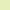

# Github Language Colors

A list of the colors used by GitHub specified in [github/linguist](https://github.com/github/linguist)

Generate this `README.md` and the `./svgs/*.svg` with Golang: `go run main.go`

